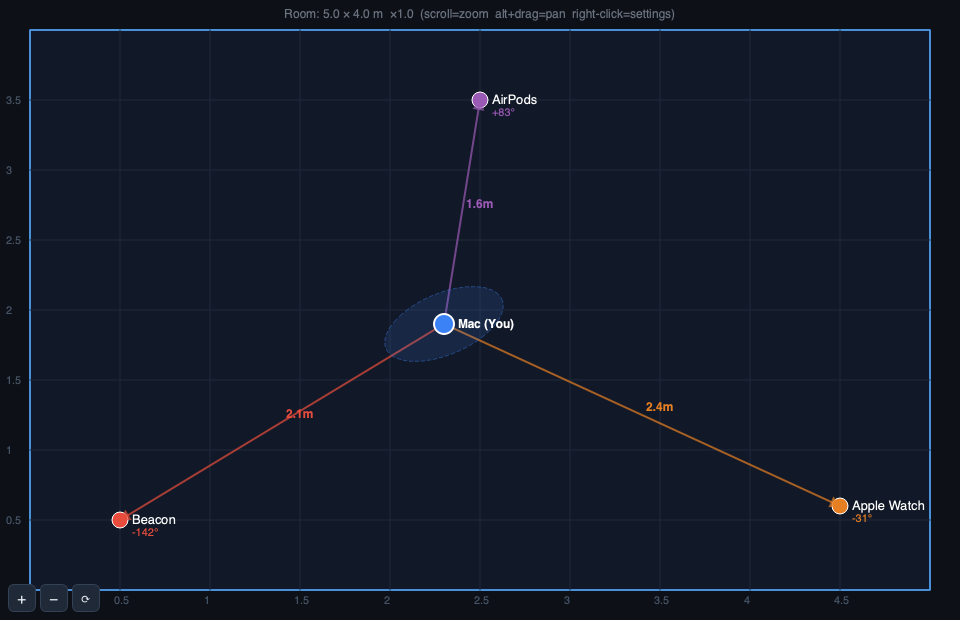
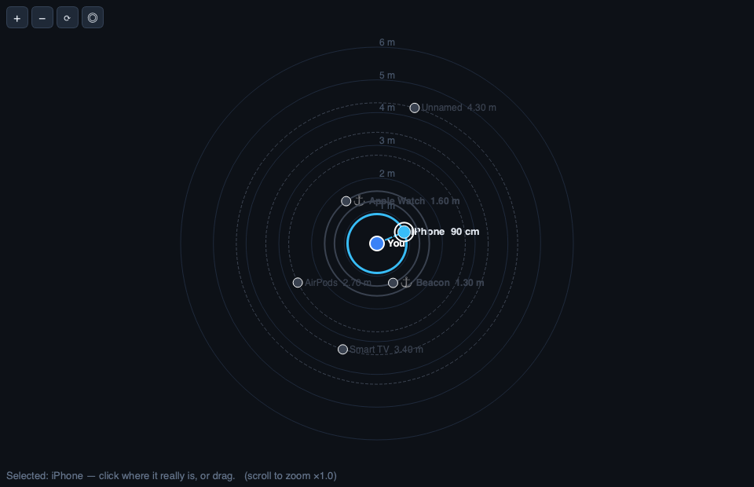

# BLE Locator — Indoor Positioning with Bluetooth Low Energy

A desktop application that turns a Mac's Bluetooth radio into an **indoor positioning system**.
It discovers nearby Bluetooth Low Energy (BLE) devices, converts their signal strength (RSSI) into
distance, and — given a few calibrated reference points — estimates *where you are* inside a room in
real time.

> Built as a portfolio project to explore a hard, real-world signal-processing problem end to end:
> from raw radio noise, through a filtering pipeline, to a live position on a map.

**Stack:** Python 3.12 · PyQt6 · NumPy / SciPy · `bleak` (CoreBluetooth) · pytest (246 tests)

| Position Map — trilateration from 3 anchors | Distance Radar — range to every device |
|:---:|:---:|
|  |  |

*Rendered from the app's own widgets with sample data (`docs/render_screenshots.py`).*

---

## The goal

GPS does not work indoors. The goal of this project was to see how accurately a room-scale position
could be recovered using **only commodity BLE hardware** (the Bluetooth already in a laptop and the
phones/watches/earbuds around you) — no beacons to buy, no extra sensors.

The honest answer this project surfaces is also part of its value: **RSSI-based ranging is noisy and
device-specific.** A large part of the work is therefore about *managing uncertainty* — filtering,
outlier rejection, multipath (echo) detection, and being transparent in the UI about what is
trustworthy (distance) versus what is inferred (a 2-D point).

---

## What it does

- **Live device discovery** — every BLE advertiser in range, with signal strength, name, manufacturer
  and its CoreBluetooth UUID.
- **Distance estimation** — RSSI → metres via a log-distance path-loss model, smoothed by a
  Median → Hampel → Kalman filter chain.
- **2-D positioning** — mark **3+ devices as anchors** (known X/Y) and the app trilaterates your
  position, with an uncertainty ellipse. A particle filter and weighted-centroid estimator are also
  available, plus a fusion/ensemble mode.
- **Distance Radar** — you at the centre, every device as a distance ring; select one to focus on it.
- **Distance A/B** — the same device's distance computed two ways (Kalman-only vs the full chain) side
  by side, so you can *see* what each filter buys you.
- **Controlled measurement** — Start/Stop a fresh measurement session; the per-device distance is
  always smoothed, the position fix runs only while measuring.
- **Echo & clutter handling** — high-variance (multipath) devices are flagged; an RSSI threshold and a
  persistence filter hide weak/phantom devices caused by BLE address randomisation.

There is also an experimental **multi-antenna mode** (a companion iOS "antenna" app in
[`ios-antenna/`](ios-antenna/) streams its own scan to the Mac over WebSocket + mDNS) for true
multi-receiver triangulation — the direction the project is evolving toward.

---

## How it works — the signal pipeline

```
BLE advertisement
      │  sensor/ble_scanner.py            (bleak / CoreBluetooth callback → SignalReading)
      ▼
Median filter ─► Hampel filter ─► Adaptive Kalman     filtering/   (reject spikes, then smooth)
      │
      ▼
RSSI → distance     engine/distance.py    d = 10^((txPower − RSSI) / (10·n))   (log-distance path loss)
      │
      ├─► Distance per device            → device list · radar · A/B table
      │
      ▼  (3+ anchors)
Trilateration / Particle filter / Centroid   engine/   → (x, y) + uncertainty
      │
      ▼
PyQt6 UI     ui/    (room map, radar, charts, benchmark)
```

A per-device NLOS (non-line-of-sight) detector watches RSSI variance to flag multipath. The math is
kept deliberately simple and classic — a single-slope log-distance model — because exotic tuning
proved less robust than an honest, well-filtered baseline.

---

## Architecture

The code is organised in dependency layers, each swappable behind an interface (`core/interfaces.py`):

| Layer | Package | Responsibility |
|-------|---------|----------------|
| Sensing | `sensor/` | BLE / Wi-Fi scanners → `SignalReading` |
| Filtering | `filtering/` | Median, Hampel, adaptive Kalman, NLOS detector |
| Engine | `engine/` | Pure math: distance, trilateration, particle filter, GDOP |
| Services | `services/` | Orchestration — the "brain" that produces a position |
| Storage | `storage/` | Anchor calibration persistence (JSON) |
| Networking | `net/` · `antennas/` | Multi-antenna WebSocket server + mDNS discovery |
| Traceability | `traceability/` | Event bus for observability |
| UI | `ui/` | PyQt6 desktop views |

A deeper Hebrew architecture walkthrough (with diagrams) lives in
[`ארכיטקטורה.md`](ארכיטקטורה.md); the Hebrew end-user guide is
[`docs/USER_GUIDE.he.md`](docs/USER_GUIDE.he.md).

---

## Run it

Requires **Python 3.12** (PyQt6 does not yet build on 3.14) and macOS with Bluetooth.

```bash
git clone https://github.com/omerbbbb/ble-locator.git && cd ble-locator
make setup     # create .venv and install dependencies
make test      # run the 246-test suite
make run       # launch the app
```

Per-package tests: `make test-engine` · `make test-filtering` · `make test-services`.

Build a standalone, double-clickable macOS app (PyInstaller):

```bash
make build     # → dist/BLE Locator.app
```

macOS will ask for **Bluetooth** permission on first launch (System Settings → Privacy & Security →
Bluetooth).

---

## Results

### Filter chain vs Kalman-only (simulated, reproducible)

Numbers from `make bench-sim` — a seeded simulation of realistic indoor BLE noise (log-normal
shadowing σ = 3.5 dB plus 8 % multipath spikes), 60 s per point at 1 Hz, first 15 s discarded for
filter warm-up. **This is a simulation, not a room measurement** — it isolates what the *algorithms*
contribute, independent of any particular room.

| Device profile (assumed RSSI@1m) | Raw RSSI | Kalman only | Full chain | Improvement |
|---|---:|---:|---:|---:|
| Beacon-like (−59 dBm) | 0.83 m | 0.58 m | **0.39 m** | −33 % |
| Watch-like (−64 dBm)  | 0.80 m | 0.52 m | **0.30 m** | −42 % |
| iPhone-like (−72 dBm) | 0.83 m | 0.61 m | **0.45 m** | −26 % |

Mean absolute distance error, averaged over true distances of 0.5–4 m. The full
Median → Hampel → Kalman chain cuts distance error by roughly **a quarter to nearly half** compared
with a Kalman filter alone, because the median/Hampel stages reject multipath spikes before they reach
the smoother.

### Why an iPhone "reads far" — the calibration bound

Same simulation, but every device is measured against the app's single default reference (−59 dBm)
instead of its own RSSI@1m:

| Device profile | True 2 m reads as | Cause |
|---|---:|---|
| Beacon-like | 2.0 m | matches the default |
| Watch-like  | 3.3 m | radio 5 dB weaker than assumed |
| iPhone-like | 6.3 m | radio 13 dB weaker than assumed |

**Absolute accuracy is bounded by per-device calibration of RSSI@1m** — a physics limit of RSSI
ranging, not a software one. The filter chain removes noise; it cannot remove a systematic offset.
Full tables and the noise model: [`docs/benchmark/SIMULATED_ACCURACY.md`](docs/benchmark/SIMULATED_ACCURACY.md).

### Real-room measurements

A ground-truth measurement tool is included. Hold a device at a known distance from the Mac and run:

```bash
make measure DEVICE=iPhone DIST=1.0      # ~30 s recording
```

Each run scores raw vs Kalman-only vs full-chain against the true distance, appends to
`docs/benchmark/measurements.csv`, and regenerates
[`docs/benchmark/REAL_MEASUREMENTS.md`](docs/benchmark/REAL_MEASUREMENTS.md) — per-device error and
the Kalman-vs-full-chain gain in a real room. *(Real-room table to be filled from on-site measurements.)*

---

## Testing

246 unit tests (pytest) cover the engine math, the filter chain, the services, storage, and the wire
protocol — run with `make test`. The signal-processing core is deliberately UI-independent so it can
be tested in isolation.

---

## Project status & limitations

This is a working research/portfolio project, not a production product. Known, intentional limits:

- **Single Mac antenna → distance, not true 2-D.** One receiver gives range (a circle); the X/Y point
  is inferred from anchor geometry. Multi-antenna mode addresses this.
- **RSSI is device-specific.** Without per-device calibration, absolute distances differ between an
  iPhone (low TX power) and a beacon at the same range — the UI is explicit about this.
- **Multipath and address randomisation** are fundamental to 2.4 GHz BLE and are *managed*, not
  eliminated.

---

## License

[MIT](LICENSE) © 2026 Omer Boim
